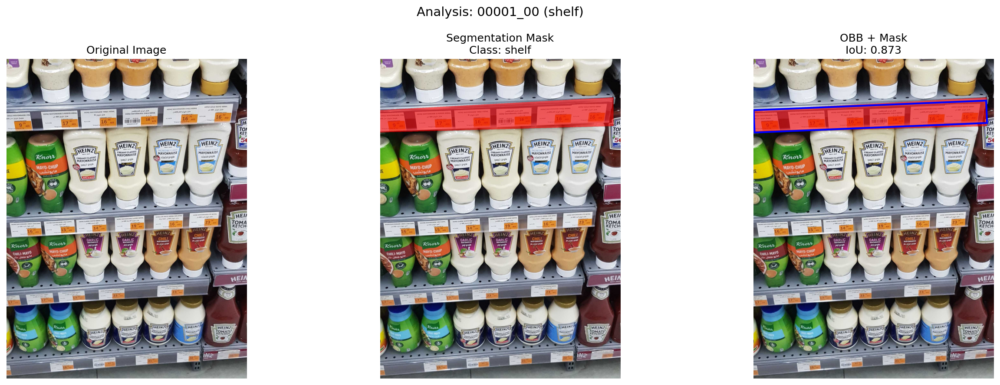
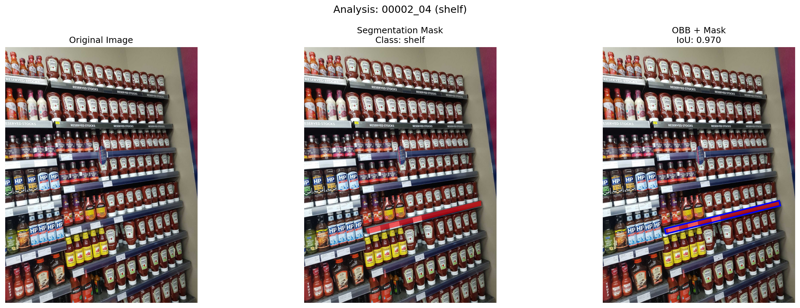
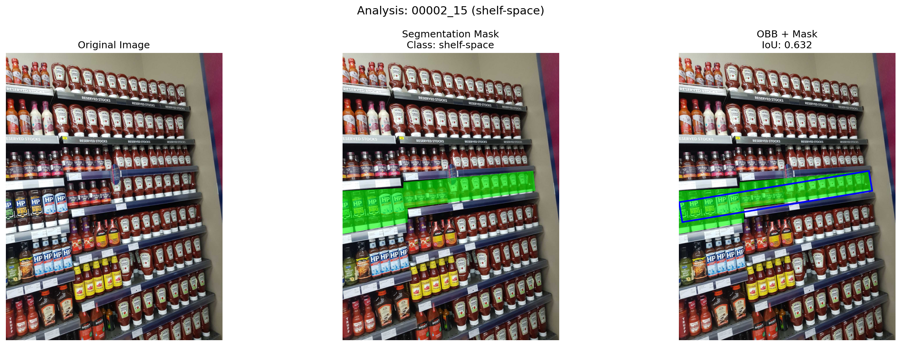
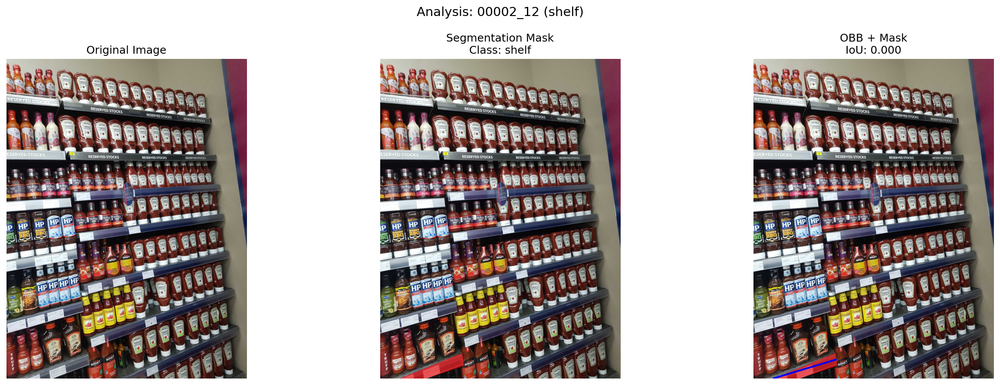
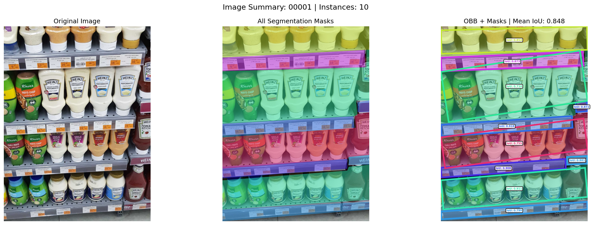
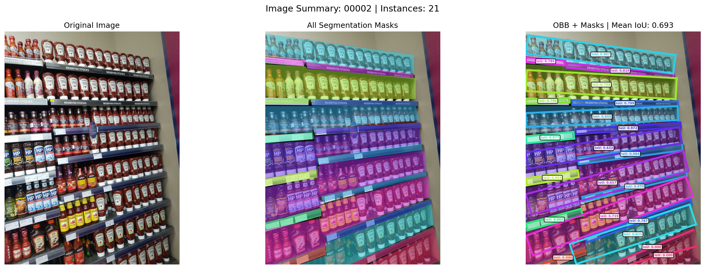
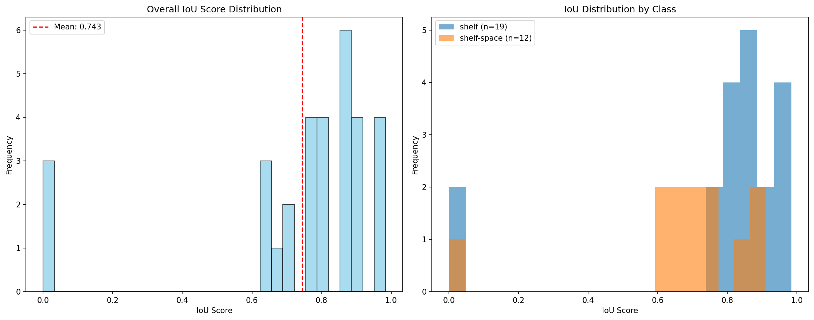

# 📊 Shelf Dataset IoU Analysis Tool

A comprehensive tool for analyzing Intersection over Union (IoU) scores between YOLO format Oriented Bounding Boxes (OBB) and segmentation polygons. This tool provides detailed visualization and analysis capabilities for shelf detection datasets.

## 🎯 Features

### 📈 **IoU Analysis**
- **YOLO OBB Parsing**: Supports YOLO format oriented bounding box detection files
- **Segmentation JSON Parsing**: Processes polygon-based segmentation annotations
- **Dynamic IoU Calculation**: Computes precise IoU scores using Shapely geometric operations
- **Instance Matching**: Intelligent matching between OBB and segmentation instances

### 🎨 **Advanced Visualization**
- **Individual Instance Analysis**: Detailed comparison for each detected instance
- **Summary Visualizations**: 3-panel summary showing original image, all masks, and OBB+masks
- **Dynamic Color System**: Unique colors for each instance using HSV color space
- **Low IoU Case Detection**: Special highlighting for instances with IoU < 0.5

### 📊 **Comprehensive Reporting**
- **JSON Output**: Structured results with individual and mean IoU scores per image
- **Detailed Reports**: Text-based analysis reports with statistics
- **Analysis Charts**: Histogram distributions and class-based comparisons
- **Performance Metrics**: Overall statistics and class-specific analysis

## 🎨 Visualization Examples

### Individual Instance Analysis
Each instance gets a detailed 3-panel visualization:
- **Left**: Original image
- **Center**: Segmentation mask overlay
- **Right**: OBB + mask with IoU score





For low iou cases:







### Summary Visualization
Each image gets a comprehensive 3-panel summary:
- **Left**: Original image
- **Center**: All segmentation masks 
- **Right**: OBB + masks with individual IoU scores and mean IoU





### Analysis Charts
- **Overall IoU Distribution**: Histogram with mean line
- **Class-based Comparison**: IoU distribution by class (shelf vs shelf-space)



## 📈 Performance Metrics

### JSON Output Structure
```json
{
  "analysis_summary": {
    "total_images": 150,
    "total_instances": 1250,
    "overall_mean_iou": 0.784,
    "overall_median_iou": 0.812
  },
  "image_results": [
    {
      "image_id": "00001",
      "mean_iou": 0.789,
      "instance_count": 8,
      "instances": [
        {
          "instance_id": "00",
          "class_name": "shelf",
          "iou_score": 0.856,
          "obb_area": 12500.5,
          "mask_area": 11800.2
        }
      ]
    }
  ]
}
```

### Detailed Report Features
- **General Performance Analysis**: Overall statistics
- **Class-based Analysis**: Performance by class (shelf vs shelf-space)
- **Low Performance Analysis**: Cases with IoU < 0.5
- **Top 20 Worst Cases**: Detailed list of lowest IoU scores

